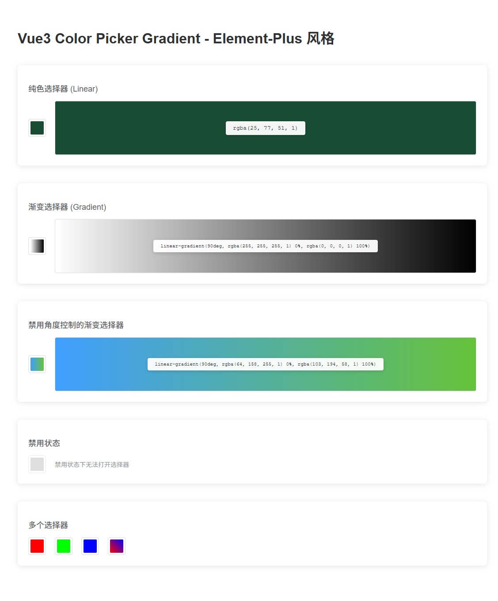

# vue3-color-picker-gradient

[](https://www.npmjs.com/package/vue2-color-picker-gradient)
[](https://www.npmjs.com/package/vue3-color-picker-gradient)
[](https://github.com/CNLHB/vue2-color-picker-gradient/stargazers)

🎨 Color Picker with Gradient support for Vue 3, inspired by Element-Plus design.

Supports both **solid colors** and **gradient colors** with an intuitive trigger button and popup panel.



## ✨ Features

- 🎯 **Element-Plus Style API** - Similar to `el-color-picker` usage
- 🌈 **Dual Mode** - Solid color (`linear`) and Gradient color (`gradient`)
- 📦 **v-model Support** - Direct color value binding
- 🎪 **Popper Dropdown** - Auto-positioning popup panel
- 🚫 **Disabled State** - Support for disabled mode
- 🎨 **Gradient Controls** - Angle adjustment and multi-point gradients
- 🎭 **Click Outside to Close** - Auto-close when clicking outside
- 📱 **Responsive** - Smart positioning on scroll and resize

## [Live demo](https://cnlhb.github.io/vue3-color-picker-gradient/build/index.html)

## Installation

### NPM

```bash
$ npm install vue3-color-picker-gradient
```

### ES6

**Global Registration**

```js
import { createApp } from 'vue'
import ColorPickerGradient from 'vue3-color-picker-gradient'

const app = createApp(App)
app.use(ColorPickerGradient)
```

**Local Registration**

```js
import ColorPickerGradient from 'vue3-color-picker-gradient'

export default {
  name: 'App',
  components: {
    ColorPickerGradient,
  },
}
```

## 📚 API

### Props

| Property | Type | Default | Description |
|----------|------|---------|-------------|
| `modelValue` / `v-model` | String | `''` | Binding value (rgba string for solid color, linear-gradient string for gradient) |
| `type` | String | `'linear'` | Picker type: `'linear'` (solid) or `'gradient'` (gradient) |
| `disabled` | Boolean | `false` | Whether to disable the picker |
| `showAlpha` | Boolean | `true` | Whether to display alpha slider |
| `disabledColorDeg` | Boolean | `false` | Whether to disable angle control (gradient mode only) |
| `colorFormat` | String | `'rgba'` | Color format |
| `size` | String | `'default'` | Picker size: `'large'` / `'default'` / `'small'` |
| `titleConfig` | Object | `{text:'颜色选择器',show:true}` | Title configuration |

### Events

| Event Name | Parameters | Description |
|------------|------------|-------------|
| `change` | `(value: string)` | Triggered when the color value changes |
| `active-change` | `(value: string)` | Triggered when the active color changes |

## 📖 Usage Examples

### Basic Usage - Solid Color

```vue
<template>
  <ColorPickerGradient
    v-model="color"
    type="linear"
    @change="handleColorChange"
  />
</template>

<script>
import { ref } from 'vue'
import ColorPickerGradient from 'vue3-color-picker-gradient'

export default {
  components: { ColorPickerGradient },
  setup() {
    const color = ref('rgba(255, 0, 0, 1)')

    const handleColorChange = (value) => {
      console.log('Color changed:', value)
    }

    return { color, handleColorChange }
  }
}
</script>
```

### Gradient Color

```vue
<template>
  <ColorPickerGradient
    v-model="gradient"
    type="gradient"
  />
</template>

<script>
import { ref } from 'vue'
import ColorPickerGradient from 'vue3-color-picker-gradient'

export default {
  components: { ColorPickerGradient },
  setup() {
    const gradient = ref('linear-gradient(90deg, rgba(255,0,0,1) 0%, rgba(0,0,255,1) 100%)')

    return { gradient }
  }
}
</script>
```

### Disabled State

```vue
<template>
  <ColorPickerGradient
    v-model="color"
    :disabled="true"
  />
</template>
```

### Disable Angle Control (Gradient Mode)

```vue
<template>
  <ColorPickerGradient
    v-model="gradient"
    type="gradient"
    :disabledColorDeg="true"
  />
</template>
```

### Complete Example

```vue
<template>
  <div class="demo">
    <h2>Solid Color Picker</h2>
    <ColorPickerGradient
      v-model="solidColor"
      type="linear"
      @change="handleChange"
    />
    <div class="preview" :style="{ background: solidColor }">
      {{ solidColor }}
    </div>

    <h2>Gradient Color Picker</h2>
    <ColorPickerGradient
      v-model="gradientColor"
      type="gradient"
      @change="handleGradientChange"
    />
    <div class="preview" :style="{ background: gradientColor }">
      {{ gradientColor }}
    </div>
  </div>
</template>

<script>
import { ref } from 'vue'
import ColorPickerGradient from 'vue3-color-picker-gradient'

export default {
  components: { ColorPickerGradient },
  setup() {
    const solidColor = ref('rgba(64, 158, 255, 1)')
    const gradientColor = ref('linear-gradient(90deg, rgba(255,255,255,1) 0%, rgba(0,0,0,1) 100%)')

    const handleChange = (value) => {
      console.log('Solid color:', value)
    }

    const handleGradientChange = (value) => {
      console.log('Gradient color:', value)
    }

    return {
      solidColor,
      gradientColor,
      handleChange,
      handleGradientChange
    }
  }
}
</script>

<style scoped>
.demo {
  padding: 20px;
}

.preview {
  width: 200px;
  height: 100px;
  margin-top: 10px;
  border-radius: 4px;
  display: flex;
  align-items: center;
  justify-content: center;
  color: white;
  font-size: 12px;
  text-shadow: 1px 1px 2px rgba(0, 0, 0, 0.5);
}
</style>
```

## 🔧 Development

### Install Dependencies

```bash
npm install
```

### Compiles and hot-reloads for development

```bash
npm run serve
```

### Compiles and minifies for library

```bash
npm run lib
```

### Lints and fixes files

```bash
npm run lint
```

## 🔄 Migration from Old API

If you're upgrading from the old API, here's a comparison:

**Old API (v-model controls visibility):**
```vue
<ColorPicker
  v-model="isShowColorPicker"
  type="linear"
  @changeColor="changeColor"
  :pColor="pColor"
/>
```

**New API (v-model binds color value):**
```vue
<ColorPickerGradient
  v-model="color"
  type="linear"
  @change="handleChange"
/>
```

### Key Changes:
- ✅ `v-model` now binds the **color value** directly (not visibility)
- ✅ Automatic **trigger button** with popup panel
- ✅ Simplified event: `@change` instead of `@changeColor`
- ✅ Simplified props: direct color string instead of complex objects
- ✅ Auto-close on outside click (no need for `closeOnClickBody`)

## 🤝 Contributing

Contributions are welcome! Feel free to submit issues and pull requests.

## 📄 License

MIT

## ⭐ Show Your Support

If this project helped you, please give it a ⭐️!

欢迎点个 star 🎉🎉🎉

---

### Customize configuration

See [Configuration Reference](https://cli.vuejs.org/config/).
